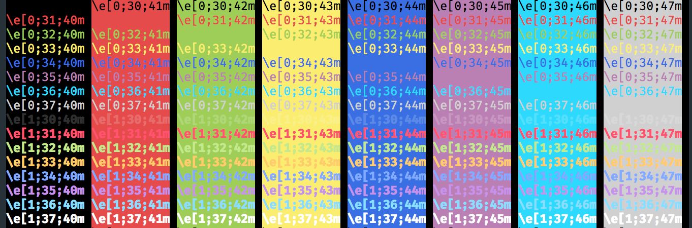
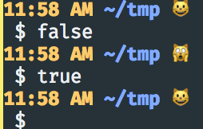
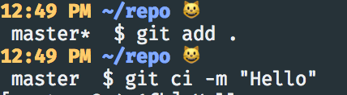
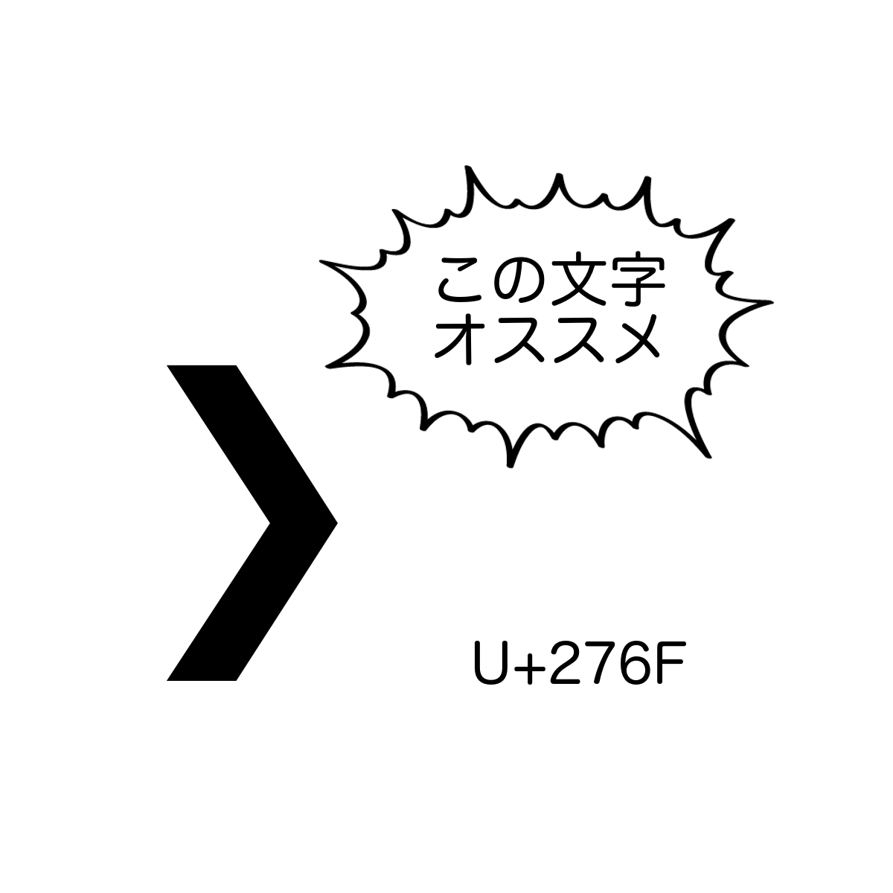

# PS1芸

---?image=pika.png&size=cover

## 私は

- coord.e [こーでぃ]
- Python, JavaScript, †C++†

- @fa[twitter] @coord\_e
- @fa[github] github.com/coord-e

---

## PS1 → bashのプロンプト

```bash
user@hostname:~$
```

---

## もっとかっこよくしよう

---

## ルール

- `bash`縛り

ﾚｯﾂｺﾞ-

---

## PS1の特殊文字

```
 \d   日付
 \h   ホスト名(\Hもあり)
 \@   時間(\t, \Tとかもある)
 \u   ユーザー名
 \w   現在のディレクトリ
 \W   `\w`の`basename`
 \$   `root`なら`#`、違うなら`$`
```

---

## PS1の特殊文字

```bash
export PS1="\@ \W \$ "
```

```bash
11:28 AM ~ $ ls
```

---

## 色をつける



色をつけたいところを

`\[\e[<色コード>\]`と`\[\033[00m\]`で挟む感じ

---

## 色をつける

```bash
export PS1="\[\e[01;33m\]\@\[\033[00m\] \[\e[01;34m\]\w\[\033[00m\] \$ "
```


---

## `PROMPT_COMMAND`を使う

- プロンプト出すときに実行される物を設定できる
- もっとダイナミックに表示を変えたいなど

---

## `PROMPT_COMMAND`

```bash
export PROMPT_COMMAND="__prompt_command"
__prompt_command() {
  # ここでPS1を変える
}
```

---

## 終了コードで猫の機嫌を変える

```bash
export PROMPT_COMMAND="__prompt_command"
__prompt_command() {
  EXIT="$?"

  export PS1="\[\e[01;33m\]\@\[\033[00m\] \[\e[01;34m\]\w\[\033[00m\] "

  if [ "$EXIT" = "0" ]; then
    PS1+="😺"
  else
    PS1+="🙀"
  fi
  PS1+=" \$ "
}
```

---

## 猫の様子



---

## Gitリポジトリのステータスを表示して見る

```bash
function __prompt_git_branch()
{
  git symbolic-ref HEAD 2>/dev/null >/dev/null &&
  echo -n "$(git symbolic-ref HEAD 2>/dev/null | sed 's/^refs\/heads\///')"
  test -n "$(git diff 2>/dev/null)" && echo -n "*"
}
```

---

## Gitリポジトリのステータスを表示して見る

```bash
function __prompt_git_arrows()
{
  BRANCH=$(__prompt_git_branch)
  test -n "$(git log ..origin/$BRANCH 2>/dev/null)" && echo -n "⇣"
  test -n "$(git log origin/$BRANCH.. 2>/dev/null)" && echo -n "⇡"
}
```

---

```bash
export PROMPT_COMMAND="__prompt_command"
__prompt_command() {
  EXIT="$?"

  export PS1="\[\e[01;33m\]\@\[\033[00m\] \[\e[01;34m\]\w\[\033[00m\] "

  if [ "$EXIT" = "0" ]; then
    PS1+="😺"
  else
    PS1+="🙀"
  fi
  PS1+="\n $(__prompt_git_branch) $(__prompt_git_arrows) \$ "
}
```

---



---

## 最後に



---

## ありがとうございました

by @coord\_e
